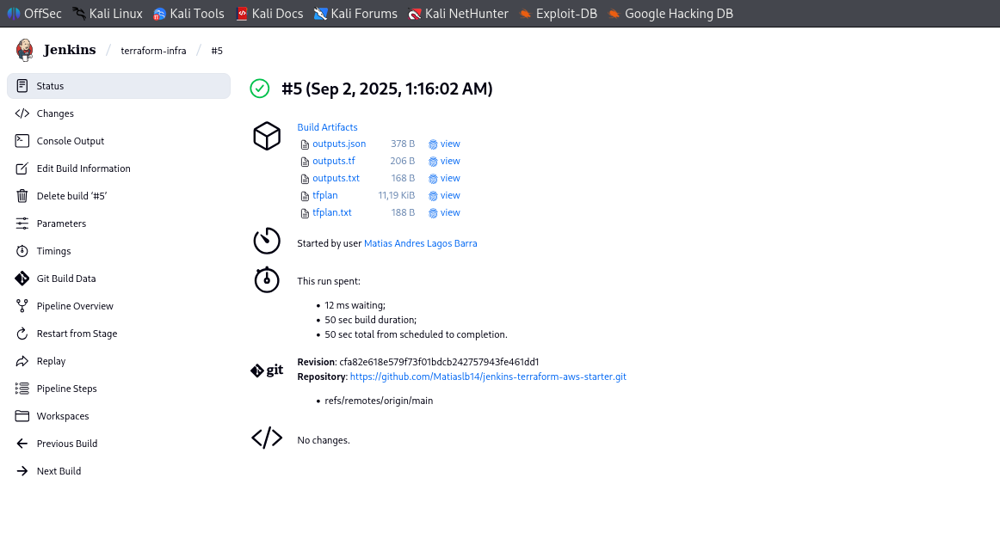

# Jenkins + Terraform + AWS (starter)

A minimal CI/CD pipeline that plans/applies Terraform to provision an EC2 with Nginx.

## What it does
- Terraform state in **S3** with **DynamoDB** locks  
- Provisions **EC2** + Nginx via `user_data`  
- Jenkins pipeline with **PLAN/APPLY** stages and artifacts (`tfplan`, `outputs.*`)

## Repository structure
.
├── Jenkinsfile # Declarative Jenkins pipeline
└── infra/ # Terraform code
├── backend.hcl # S3 + DynamoDB backend config
├── main.tf # EC2 + security group + user_data (Nginx)
├── outputs.tf # Useful outputs (DNS, IP, URL)
├── variables.tf
└── tfplan (artifact) # Generated by pipeline (ignored in VCS)

## Prerequisites
- AWS account and Access Key/Secret (configured in Jenkins as a credential, e.g. `aws-creds`)
- An S3 bucket and a DynamoDB table for the Terraform backend (configure in `infra/backend.hcl`)
- Jenkins (with Git and Pipeline)

## Getting started
1. Update `infra/backend.hcl` with your S3 bucket / DynamoDB table.
2. In Jenkins, create credentials for AWS (Access Key / Secret) and set the ID used in the `Jenkinsfile`.
3. Run the pipeline:
   - `PLAN` → generates `tfplan` and `outputs.*`
   - `APPLY` → provisions EC2 and bootstraps Nginx

## Cleanup
To destroy the infrastructure:
- In Jenkins, run the pipeline with action `DESTROY` (or run `terraform destroy` from `infra/` if you have the credentials locally).

## Next steps
- Track A: Remote Jenkins + webhooks (GitHub -> Jenkins)
- Track B: Multi-env (dev/prod), variables/TF vars, tests

